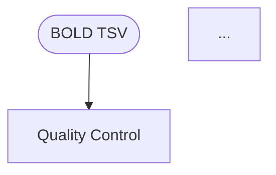

# BOLDGenotyper Flow Chart Rendering Guide

This guide explains how to convert the Mermaid flow chart files to high-quality SVG/PNG for publication.

---

## 📁 Flow Chart Files

### 1. **Simplified Version** (Main Text Figure)
**File:** `flowchart_main_text_simplified.mmd`
- **Purpose:** High-level overview for main manuscript figure
- **Phases:** 6 major steps (QC → Haplotype Discovery → Assignment → Geographic → Optional Tree → Visualization)
- **Recommended for:** Main text Figure 1 or Figure 2

### 2. **Detailed Version** (Supplemental Figure)
**File:** `flowchart_supplemental_detailed.mmd`
- **Purpose:** Complete workflow with all sub-steps
- **Phases:** All 11 phases with decision points and sub-processes
- **Recommended for:** Supplemental Figure S1

---

## 🎨 Rendering Methods

### Method 1: Mermaid Live Editor (Easiest, Free)

**Best for:** Quick high-quality SVG export

1. **Open Mermaid Live Editor:**
   - Visit: https://mermaid.live

2. **Load your flow chart:**
   - Copy the contents of `flowchart_main_text_simplified.mmd` OR `flowchart_supplemental_detailed.mmd`
   - Paste into the editor (left panel)
   - Diagram renders automatically (right panel)

3. **Export as SVG:**
   - Click **"Actions"** (top right)
   - Select **"Download SVG"**
   - Save as `boldgenotyper_workflow_simplified.svg` or `boldgenotyper_workflow_detailed.svg`

4. **Export as PNG (optional):**
   - Click **"Actions"** → **"Download PNG"**
   - Default resolution is suitable for most uses
   - For higher resolution, use Method 2 or Method 3

**Pros:**
- ✅ No installation required
- ✅ Instant preview
- ✅ High-quality SVG output
- ✅ Free

**Cons:**
- ❌ Limited control over resolution for PNG
- ❌ Must manually copy/paste code

---

### Method 2: Mermaid CLI (Best for Automation)

**Best for:** Scriptable, reproducible, high-resolution PNG

#### Installation:

```bash
# Install Node.js if not already installed (required for Mermaid CLI)
# Visit: https://nodejs.org/ or use package manager:
# macOS: brew install node
# Linux: sudo apt install nodejs npm

# Install Mermaid CLI globally
npm install -g @mermaid-js/mermaid-cli
```

#### Render to SVG:

```bash
# Navigate to docs directory
cd /Users/stesmith/Documents/depredation/boldgenotyper/docs/

# Render simplified version to SVG
mmdc -i flowchart_main_text_simplified.mmd -o flowchart_main_text_simplified.svg

# Render detailed version to SVG
mmdc -i flowchart_supplemental_detailed.mmd -o flowchart_supplemental_detailed.svg
```

#### Render to High-Resolution PNG:

```bash
# Simplified version - 300 DPI equivalent (width: 3000px for ~10 inch width)
mmdc -i flowchart_main_text_simplified.mmd \
     -o flowchart_main_text_simplified.png \
     -w 3000 \
     -H 4000 \
     -b transparent

# Detailed version - 300 DPI equivalent (larger for readability)
mmdc -i flowchart_supplemental_detailed.mmd \
     -o flowchart_supplemental_detailed.png \
     -w 3500 \
     -H 8000 \
     -b transparent
```

#### Custom Configuration (optional):

Create `mermaid-config.json` for custom styling:

```json
{
  "theme": "base",
  "themeVariables": {
    "primaryColor": "#e3f2fd",
    "primaryTextColor": "#000000",
    "primaryBorderColor": "#1976d2",
    "lineColor": "#424242",
    "secondaryColor": "#fff3e0",
    "tertiaryColor": "#f1f8e9"
  },
  "flowchart": {
    "htmlLabels": true,
    "curve": "basis",
    "padding": 15
  }
}
```

Then render with config:

```bash
mmdc -i flowchart_main_text_simplified.mmd \
     -o flowchart_main_text_simplified.svg \
     -c mermaid-config.json
```

**Pros:**
- ✅ Scriptable and reproducible
- ✅ High control over resolution
- ✅ Batch processing
- ✅ Custom configuration

**Cons:**
- ❌ Requires Node.js installation
- ❌ Command-line interface

---

### Method 3: Visual Studio Code Extension (Best for Interactive Editing)

**Best for:** Iterative editing with live preview

#### Setup:

1. **Install VS Code:**
   - Download from: https://code.visualstudio.com/

2. **Install Mermaid Extension:**
   - Open VS Code
   - Go to Extensions (Cmd+Shift+X on macOS, Ctrl+Shift+X on Windows/Linux)
   - Search for **"Mermaid Preview"** or **"Markdown Preview Mermaid Support"**
   - Install the extension

3. **Open and Preview:**
   - Open `flowchart_main_text_simplified.mmd` in VS Code
   - Right-click in editor → **"Open Preview to the Side"**
   - Live preview appears as you edit

4. **Export:**
   - Preview panel → Right-click → **"Save as SVG"** or **"Save as PNG"**
   - Choose resolution and location

**Pros:**
- ✅ Live preview while editing
- ✅ Syntax highlighting
- ✅ Easy to iterate on design
- ✅ Export directly from preview

**Cons:**
- ❌ Requires VS Code installation
- ❌ Extension may have limitations

---

### Method 4: Python with `mermaid-py` (Best for Integration)

**Best for:** Integrating into Python scripts or Jupyter notebooks

#### Installation:

```bash
# Activate your boldgenotyper environment
conda activate boldgenotyper

# Install mermaid-py
pip install mermaid-py
```

#### Usage:

```python
from mermaid import Mermaid

# Load Mermaid code
with open('flowchart_main_text_simplified.mmd', 'r') as f:
    mermaid_code = f.read()

# Create Mermaid object
diagram = Mermaid(mermaid_code)

# Render to SVG
diagram.to_svg('flowchart_main_text_simplified.svg')

# Render to PNG (requires Puppeteer/Chrome)
diagram.to_png('flowchart_main_text_simplified.png', width=3000)
```

**Note:** PNG rendering requires Puppeteer (headless Chrome), which `mermaid-py` installs automatically.

**Pros:**
- ✅ Python integration
- ✅ Programmable
- ✅ Can be part of analysis pipeline

**Cons:**
- ❌ Requires additional dependencies
- ❌ May have compatibility issues

---

### Method 5: GitHub/GitLab Rendering (Best for Documentation)

**Best for:** Including in README or documentation

#### GitHub:

1. **Create a Markdown file** (e.g., `WORKFLOW.md`):

````markdown
# BOLDGenotyper Workflow


````

2. **Push to GitHub:**
   - Diagram renders automatically in GitHub's Markdown viewer
   - Right-click on rendered diagram → **"Save image as..."**

#### GitLab:

- Same as GitHub, but GitLab also allows **"Download as SVG"** directly from rendered diagram

**Pros:**
- ✅ No installation needed
- ✅ Version-controlled
- ✅ Renders in documentation automatically

**Cons:**
- ❌ Requires GitHub/GitLab account
- ❌ Limited export options
- ❌ May not render complex diagrams perfectly

---

## 📐 Recommended Settings for Publication

### For Main Text Figure (Simplified):
- **Format:** SVG (preferred) or PNG
- **Resolution (if PNG):** 300 DPI equivalent
  - Width: 3000-3500 px (for ~10-12 inch width at 300 DPI)
  - Height: Auto-scale or 4000-5000 px
- **Background:** Transparent or white (match journal requirements)

### For Supplemental Figure (Detailed):
- **Format:** SVG (highly recommended due to complexity)
- **Resolution (if PNG):** 300 DPI equivalent
  - Width: 3500-4000 px
  - Height: 8000-10000 px (tall diagram)
- **Background:** Transparent or white

### Color Scheme:
Both diagrams use a publication-friendly color palette:
- **Input data:** Light blue (#bbdefb)
- **Processing steps:** Light green (#c8e6c9)
- **Decision points:** Light yellow (#fff9c4)
- **Excluded data:** Light coral (#ffccbc, dashed border)
- **Output data:** Light purple (#e1bee7)
- **Count/metric boxes:** Cyan (#b3e5fc)

**Color-blind friendly:** Yes (tested with Color Oracle)

---

## 🔧 Post-Processing (Optional)

If you need to further edit the SVG files:

### Vector Editing Tools:

1. **Inkscape** (Free, Open Source)
   - Download: https://inkscape.org/
   - Use for: Adjusting text, colors, layout
   - Export to: PDF, EPS, PNG at any resolution

2. **Adobe Illustrator** (Commercial)
   - Use for: Professional-grade editing
   - Export to: AI, PDF, EPS formats

3. **Affinity Designer** (One-time purchase)
   - Use for: Cost-effective alternative to Illustrator

### Recommended Edits:
- ✅ Adjust box sizes for better readability
- ✅ Fine-tune arrow positions
- ✅ Add annotations or callouts
- ✅ Customize colors to match journal style
- ✅ Add figure legends or keys

---

## 📊 Integration with Manuscript

### LaTeX:

```latex
\begin{figure}[h]
    \centering
    \includegraphics[width=\textwidth]{flowchart_main_text_simplified.pdf}
    \caption{BOLDGenotyper workflow overview. Sequences undergo quality control,
             haplotype discovery using an exact sequence variant (ESV) approach,
             and geographic analysis with ocean basin assignment.}
    \label{fig:workflow}
\end{figure}
```

### Microsoft Word:

1. Insert SVG directly (Word 2016+):
   - Insert → Pictures → Select SVG file
   - SVG remains editable within Word

2. Convert to high-res PNG first (if compatibility issues):
   - Insert PNG at 300 DPI
   - Ensure "Lock aspect ratio" is checked

### Google Docs:

- Insert → Image → Upload from computer
- Use PNG format (Google Docs doesn't support SVG directly)

---

## 🎯 Quick Start: Recommended Workflow

**For most users, I recommend:**

1. **Use Mermaid Live Editor** (https://mermaid.live) for initial SVG export
   - Fast, no installation, high quality
   - Perfect for simple edits and quick previews

2. **Use Mermaid CLI** if you need:
   - High-resolution PNG (>300 DPI)
   - Batch processing of multiple versions
   - Automation/scripting

3. **Post-process in Inkscape** if you need:
   - Fine-tune layout
   - Add custom annotations
   - Match specific journal style requirements

---

## 📝 Example: Complete Workflow

```bash
# 1. Navigate to docs directory
cd /Users/stesmith/Documents/depredation/boldgenotyper/docs/

# 2. Render both diagrams to SVG
mmdc -i flowchart_main_text_simplified.mmd -o flowchart_main_text_simplified.svg
mmdc -i flowchart_supplemental_detailed.mmd -o flowchart_supplemental_detailed.svg

# 3. Render high-res PNG for main text (300 DPI, ~10 inch width)
mmdc -i flowchart_main_text_simplified.mmd \
     -o flowchart_main_text_simplified.png \
     -w 3000 \
     -b white

# 4. Render high-res PNG for supplemental (300 DPI, larger dimensions)
mmdc -i flowchart_supplemental_detailed.mmd \
     -o flowchart_supplemental_detailed.png \
     -w 3500 \
     -H 8000 \
     -b white

# 5. Convert SVG to PDF (for LaTeX, if needed)
# Requires Inkscape command-line:
inkscape flowchart_main_text_simplified.svg \
         --export-filename=flowchart_main_text_simplified.pdf

# 6. Verify output files
ls -lh flowchart_*
```

---

## 🔍 Troubleshooting

### Issue: "Command not found: mmdc"

**Solution:** Install Mermaid CLI
```bash
npm install -g @mermaid-js/mermaid-cli
```

### Issue: "Diagram too large to render"

**Solution:** For very detailed diagrams, increase Node.js memory:
```bash
export NODE_OPTIONS="--max-old-space-size=4096"
mmdc -i flowchart_supplemental_detailed.mmd -o output.svg
```

### Issue: "Text is cut off in exported image"

**Solution 1:** Add padding in Mermaid config
```json
{
  "flowchart": {
    "padding": 20
  }
}
```

**Solution 2:** Increase canvas size
```bash
mmdc -i input.mmd -o output.png -w 4000 -H 6000
```

### Issue: "Colors look wrong in PDF"

**Solution:** Export SVG first, then convert to PDF using Inkscape or Illustrator
- SVG → PDF maintains color profiles better than direct PNG → PDF

### Issue: "Font rendering differs from preview"

**Solution:** Embed fonts in SVG or use system fonts:
```json
{
  "themeVariables": {
    "fontFamily": "Arial, Helvetica, sans-serif"
  }
}
```

---

## 📚 Additional Resources

- **Mermaid Documentation:** https://mermaid.js.org/
- **Mermaid Live Editor:** https://mermaid.live
- **Mermaid CLI Docs:** https://github.com/mermaid-js/mermaid-cli
- **Inkscape Tutorials:** https://inkscape.org/learn/tutorials/
- **Publication Graphics Guide:** https://www.nature.com/documents/Final-artwork-guide.pdf

---

## ✅ Checklist for Manuscript Submission

Before submitting your flow chart to a journal:

- [ ] SVG or high-res PNG (≥300 DPI) exported
- [ ] All text is legible at final print size
- [ ] Colors are distinguishable in grayscale (if journal prints in B&W)
- [ ] File size is reasonable (<10 MB for PNG, <5 MB for SVG)
- [ ] Figure caption written and references flow chart elements
- [ ] Figure is cited in manuscript text
- [ ] Meets journal's specific figure requirements (check guidelines)
- [ ] Supplemental figure numbering is correct (e.g., Figure S1)

---

**Questions or issues?** Open an issue at: https://github.com/SymbioSeas/BOLDGenotyper/issues
